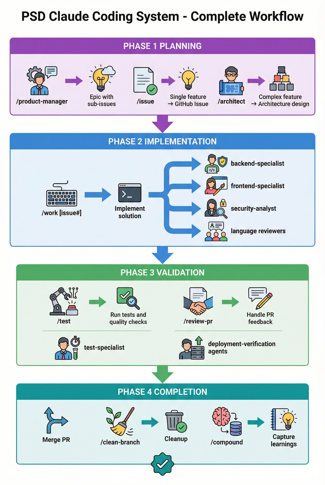
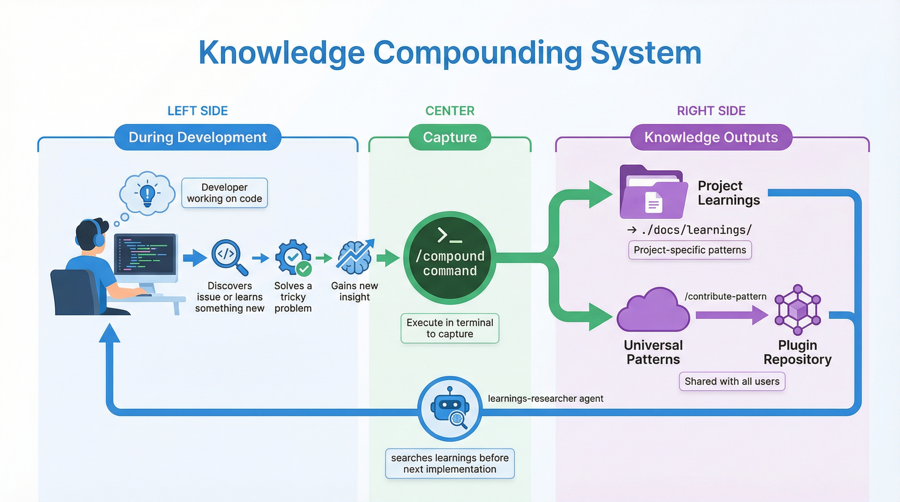

# PSD Claude Coding System

Peninsula School District's comprehensive Claude Code plugin for AI-assisted software development.

[](https://opensource.org/licenses/MIT)
[](https://docs.claude.com/en/docs/claude-code)
[]()

## Overview

**One unified plugin** combining battle-tested development workflows with self-improving meta-learning and knowledge compounding.

**Version**: 1.14.1
**Status**: Production-Ready Workflows + Experimental Meta-Learning

---

## Quick Start

```bash
# Install the marketplace
/plugin marketplace add psd401/psd-claude-coding-system

# Install the plugin
/plugin install psd-claude-coding-system

# Start using immediately
/work 347              # Implement an issue
/test                  # Run tests
/compound              # Capture learnings from session
```

---

## What's New in v1.14.1

**Compound Engineering Integration** - Major update inspired by [Every's Compound Engineering plugin](https://github.com/EveryInc/compound-engineering-plugin), integrating their best practices for knowledge compounding and language-specific reviews.

### New Agents (9 total)

| Agent | Purpose |
|-------|---------|
| `deployment-verification-agent` | Go/No-Go checklists for risky deployments |
| `data-migration-expert` | Validates ID mappings, foreign key integrity |
| `spec-flow-analyzer` | Gap analysis for feature specs, user flow permutations |
| `agent-native-reviewer` | Validates AI-agent architecture parity |
| `learnings-researcher` | Searches knowledge base before implementation |
| `typescript-reviewer` | TypeScript/JavaScript code review (light + full modes) |
| `python-reviewer` | Python code review (type hints, async, security) |
| `swift-reviewer` | Swift code review (optionals, memory, SwiftUI) |
| `sql-reviewer` | SQL code review (injection, performance, migrations) |

### New Skills (2 total)

| Skill | Purpose |
|-------|---------|
| `/compound` | Capture learnings from current session for knowledge compounding |
| `/contribute-pattern` | Share universal patterns to the plugin repository |

### Enhanced Skills

- **`/work`** - Added knowledge lookup (phase 1.5), language review (phase 4.3), deployment verification (phase 4.4)
- **`/review-pr`** - Added language-specific deep review, deployment verification for migrations
- **`/issue`** - Added spec flow analysis for complex features

### Agent Reorganization

All 30 agents organized into 7 category subdirectories:
- `agents/review/` - 10 code review specialists
- `agents/domain/` - 7 domain specialists
- `agents/quality/` - 3 quality assurance agents
- `agents/research/` - 2 research agents
- `agents/external/` - 2 external AI providers
- `agents/meta/` - 3 meta-learning agents
- `agents/validation/` - 5 validator agents

---

## How It Works



The plugin provides a complete development lifecycle:

1. **Planning** - Create issues (`/issue`) or break down big ideas into epics (`/product-manager`), design architecture (`/architect`)
2. **Implementation** - Work on issues (`/work 347`) with automatic agent assistance
3. **Validation** - Run tests (`/test`), handle PR feedback (`/review-pr`)
4. **Completion** - Clean up (`/clean-branch`), capture learnings (`/compound`)

---

## Workflow Commands (11 total)

| Command | Description | Example |
|---------|-------------|---------|
| `/work` | Implement solutions with auto reviews | `/work 347` |
| `/architect` | System architecture design | `/architect "caching system"` |
| `/test` | Comprehensive testing | `/test auth` |
| `/review-pr` | Handle PR feedback | `/review-pr 123` |
| `/issue` | AI-validated GitHub issues | `/issue "add caching"` |
| `/product-manager` | Product specs to sub-issues | `/product-manager "dashboard"` |
| `/security-audit` | Security analysis | `/security-audit` |
| `/compound` | **NEW:** Capture session learnings | `/compound` |
| `/contribute-pattern` | **NEW:** Share patterns | `/contribute-pattern` |
| `/compound-concepts` | Find automation opportunities | `/compound-concepts` |
| `/clean-branch` | Post-merge cleanup | `/clean-branch` |

---

## Meta-Learning Commands (10 total)

| Command | Description | When to Use |
|---------|-------------|-------------|
| `/meta-health` | System status dashboard | Daily/Weekly |
| `/meta-analyze` | Find workflow patterns | Weekly |
| `/meta-learn` | Get improvement suggestions | Weekly |
| `/meta-implement` | Apply improvements safely | As needed |
| `/meta-improve` | Full improvement pipeline | Weekly |
| `/meta-document` | Auto-update documentation | As needed |
| `/meta-predict` | Forecast future issues | Monthly |
| `/meta-experiment` | A/B test ideas | Advanced |
| `/meta-evolve` | Improve AI agents | Monthly |
| `/meta-compound-analyze` | Analyze learnings | Monthly |

---

## AI Agents (30 total)

### Review Specialists (10 agents)
`security-analyst` · `security-analyst-specialist` · `deployment-verification-agent` · `data-migration-expert` · `agent-native-reviewer` · `typescript-reviewer` · `python-reviewer` · `swift-reviewer` · `sql-reviewer`

### Domain Specialists (7 agents)
`backend-specialist` · `frontend-specialist` · `database-specialist` · `llm-specialist` · `ux-specialist` · `architect-specialist` · `shell-devops-specialist`

### Quality & Research (5 agents)
`test-specialist` · `performance-optimizer` · `documentation-writer` · `spec-flow-analyzer` · `learnings-researcher`

### Meta-Learning & Validation (8 agents)
`meta-orchestrator` · `code-cleanup-specialist` · `pr-review-responder` · `plan-validator` · `document-validator` · `configuration-validator` · `breaking-change-validator` · `telemetry-data-specialist`

### External AI (2 agents)
`gpt-5-codex` (GPT-5.2-pro) · `gemini-3-pro` (Gemini 3 Pro)

---

## Knowledge Compounding System



The plugin includes a hybrid knowledge capture system:

### Project Learnings (`./docs/learnings/`)
- Store project-specific patterns and solutions
- Automatically searched before implementation via `learnings-researcher`
- Captured with `/compound` after sessions with issues or discoveries

### Plugin Patterns (`docs/patterns/`)
- Universal patterns shared across all projects
- Contributed via `/contribute-pattern`
- Available to all plugin users after merge

---

## Language-Specific Reviews

The plugin automatically detects languages in changed files and invokes appropriate reviewers:

| Language | Extensions | Reviewer |
|----------|------------|----------|
| TypeScript | `.ts`, `.tsx`, `.js`, `.jsx` | `typescript-reviewer` |
| Python | `.py` | `python-reviewer` |
| Swift | `.swift` | `swift-reviewer` |
| SQL | `.sql`, `*migration*` | `sql-reviewer` |

### Dual-Phase Review

1. **Light Mode** (pre-PR in `/work`): Quick checks, critical issues only
2. **Full Mode** (post-PR in `/review-pr`): Comprehensive deep analysis

---

## Installation

### From GitHub (Recommended)

```bash
/plugin marketplace add psd401/psd-claude-coding-system
/plugin install psd-claude-coding-system
```

### Verify Installation

```bash
/plugin list
# Should show: psd-claude-coding-system (v1.14.1)

# Test a command
/meta-health
```

---

## Usage Examples

### Basic Workflow

```bash
# Work on an issue
/work 347

# Run tests
/test

# Create PR and handle feedback
/review-pr 123

# Clean up after merge
/clean-branch

# Capture what you learned
/compound
```

### Knowledge Compounding

```bash
# After a session where you discovered something useful
/compound

# If the learning applies to all projects
/contribute-pattern ./docs/learnings/build-errors/2026-01-22-vite-config-gotcha.md
```

### Meta-Learning (After 2-4 Weeks)

```bash
# Weekly improvement routine
/meta-improve

# Or step by step
/meta-analyze      # Find patterns
/meta-learn        # Get suggestions
/meta-implement    # Apply improvements
```

---

## Architecture

```
plugins/psd-claude-coding-system/
├── skills/                    # 25 user-invocable skills
│   ├── work/SKILL.md          # Main implementation workflow
│   ├── compound/SKILL.md      # Knowledge capture
│   ├── contribute-pattern/SKILL.md
│   └── meta-*/SKILL.md        # Meta-learning skills
├── agents/                    # 30 specialized agents
│   ├── review/                # Code review specialists
│   ├── domain/                # Domain experts
│   ├── quality/               # Quality assurance
│   ├── research/              # Research agents
│   ├── external/              # External AI providers
│   ├── meta/                  # Meta-learning
│   └── validation/            # Validators
├── docs/
│   └── patterns/              # Universal patterns
├── scripts/
│   ├── language-detector.sh   # Auto-detect languages
│   └── telemetry-*.sh         # Telemetry hooks
└── hooks/
    └── hooks.json             # Automatic telemetry
```

---

## Compound Engineering Principles

Every interaction creates improvement opportunities:

- Every bug → prevention system
- Every manual process → automation candidate
- Every solution → template for similar problems
- Every workflow → data for meta-learning

Use `/compound` after sessions to capture learnings.

---

## Documentation

- [Plugin README](./plugins/psd-claude-coding-system/README.md) - Detailed plugin docs
- [Meta-Learning Guide](./docs/META_LEARNING_GUIDE.md) - Command reference
- [CLAUDE.md](./CLAUDE.md) - Technical reference

---

## Support

- **Author**: Kris Hagel (hagelk@psd401.net)
- **Organization**: Peninsula School District
- **Repository**: [psd401/psd-claude-coding-system](https://github.com/psd401/psd-claude-coding-system)
- **Issues**: https://github.com/psd401/psd-claude-coding-system/issues

---

## Acknowledgments

- [Every's Compound Engineering Plugin](https://github.com/EveryInc/compound-engineering-plugin) - Inspiration for v1.14.1 knowledge compounding and language-specific review patterns
- Built with [Claude Code](https://docs.anthropic.com/en/docs/claude-code) by Anthropic

## License

MIT License - see [LICENSE](./LICENSE) for details

---

**Peninsula School District** - Innovating education through technology
