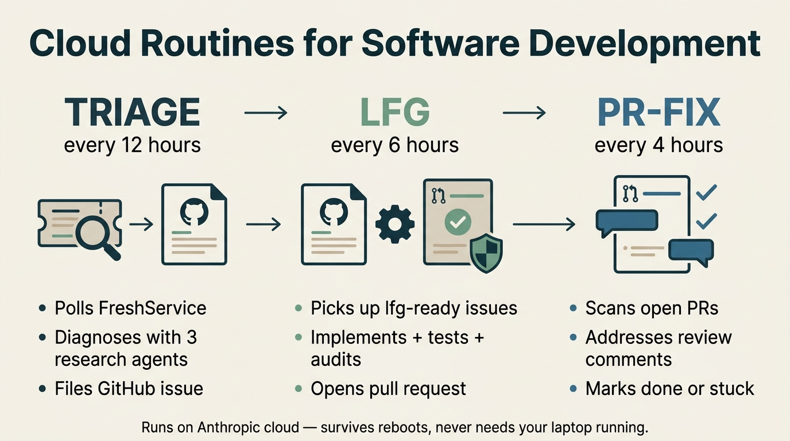
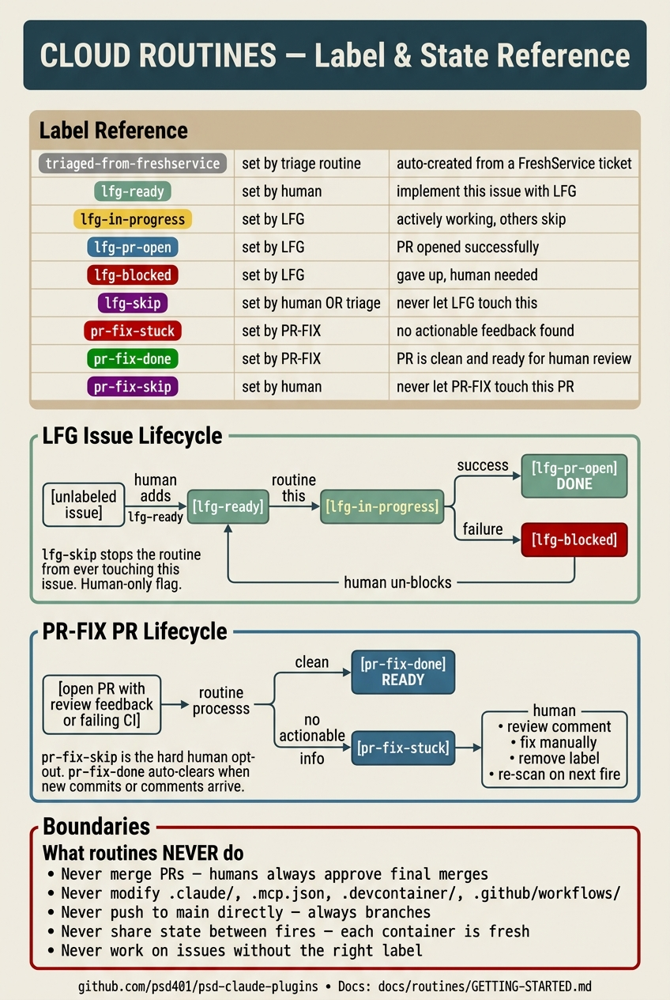

# Cloud Routines: Getting Started

Three autonomous AI agents that work on your codebase 24/7 while you sleep. You don't need to be at your computer. You don't need a session open. They run on Anthropic's cloud infrastructure, on a schedule, and hand off work to you when they're done.



For the **complete label and state-machine reference** in one picture, see also:



## What problem do these solve?

You can run `/loop` in a Claude Code session to repeat a workflow every N minutes — but the session has to stay open on your laptop. Reboot? Close the lid? Lose Wi-Fi? The loop dies. You wake up the next morning with nothing done.

**Cloud routines run on Anthropic's servers.** They survive reboots, network changes, and time zones. You set them up once and they just work.

## What you get

Three routines work together to take a bug report from "someone filed a ticket" all the way to "PR ready for human review":

| Routine | What it does | How often |
|---------|--------------|-----------|
| **triage** | Finds new FreshService tickets, diagnoses each one with three research agents (codebase, git history, reproduction), files a well-researched GitHub issue in the correct repo | every 12 hours |
| **lfg** | Picks up GitHub issues you've labeled `lfg-ready`, implements the fix, writes tests, runs a security audit, opens a PR targeting `dev` | every 6 hours |
| **pr-fix** | Scans open PRs for unaddressed review comments or failing CI, addresses what it can, marks PRs `pr-fix-done` or `pr-fix-stuck` | every 4 hours |

Each one is **independent**. You can turn on just one, all three, or any combination.

## Before you start

You need:

- A **Claude Code account on a Pro, Max, Team, or Enterprise plan** with routines enabled
- The **Claude GitHub App installed** on each repo you want the routines to touch ([github.com/apps/claude](https://github.com/apps/claude))
- A **FreshService API key** (only if you want the triage routine)

That's it. The routines themselves don't need any local install — they live entirely in the cloud.

## Architecture in plain English

Every routine fire does this:

1. **Clones the repos** you've selected, fresh, into a temporary container
2. **Runs a setup script** that installs the `gh` CLI (one-time, cached)
3. **Starts a Claude Code session** with your routine prompt as the instructions
4. **First thing the session does**: runs `bootstrap.sh`, which copies the latest agents and skills from this repo into the session's home directory. This is how the routine gets access to specialized AI subagents (`work-researcher`, `security-analyst-specialist`, etc.) that normally only work in plugins.
5. **Does the work** — polling, fixing, reviewing — using those subagents.
6. **Posts results** — GitHub issues, PRs, comments, labels.
7. **Shuts down** — the container is destroyed at the end of every run, so each fire starts clean.

The reason this matters: **the routine prompt + the bootstrap script are your single source of truth**. When you improve an agent in `plugins/psd-coding-system/agents/`, the next routine fire automatically picks up the improvement. No deployment.

## Step-by-step setup

### 1. Install the Claude GitHub App

Go to [github.com/apps/claude](https://github.com/apps/claude) → **Install** → pick your GitHub organization → choose the repos the routines should operate on.

This gives the cloud sessions permission to clone, push branches, and open issues/PRs in those repos.

### 2. Create a cloud environment

Visit [claude.ai/code/routines](https://claude.ai/code/routines) and click **New routine**. In the environment selector, click **Create new environment**.

- **Name**: `psd-automation` (or whatever you want — you'll reuse this for all three routines)
- **Network access**: Custom
  - Check "Also include default list of common package managers"
  - **Allowed domains**: add `psd401.freshservice.com` (or your FreshService domain) so the triage routine can reach it
- **Environment variables** (only if using triage):
  - `FRESHSERVICE_API_KEY` = your API key
  - `FRESHSERVICE_DOMAIN` = your domain prefix (e.g., `psd401`)
- **Setup script**: paste the entire contents of [`routines/shared/env-setup.sh`](../../routines/shared/env-setup.sh) from this repo

Save the environment.

### 3. Pre-create the labels

Each routine uses GitHub labels to coordinate. From your terminal:

```bash
for repo in your-org/repo1 your-org/repo2 your-org/repo3; do
  gh label create lfg-ready       --repo "$repo" --color "0e8a16" 2>/dev/null
  gh label create lfg-in-progress --repo "$repo" --color "fbca04" 2>/dev/null
  gh label create lfg-pr-open     --repo "$repo" --color "1d76db" 2>/dev/null
  gh label create lfg-blocked     --repo "$repo" --color "b60205" 2>/dev/null
  gh label create lfg-skip        --repo "$repo" --color "5319e7" 2>/dev/null
  gh label create pr-fix-stuck    --repo "$repo" --color "b60205" 2>/dev/null
  gh label create pr-fix-done     --repo "$repo" --color "0e8a16" 2>/dev/null
  gh label create pr-fix-skip     --repo "$repo" --color "5319e7" 2>/dev/null
  gh label create triaged-from-freshservice --repo "$repo" --color "ededed" 2>/dev/null
done
```

Replace `your-org/repo1` etc. with your actual repos.

### 4. Create each routine

For each routine you want, go to [claude.ai/code/routines](https://claude.ai/code/routines) → **New routine**:

| Field | Triage | LFG | PR-Fix |
|-------|--------|-----|--------|
| Name | `psd-triage` | `psd-lfg` | `psd-pr-fix` |
| Prompt | [routines/triage/routine-prompt.md](../../routines/triage/routine-prompt.md) | [routines/lfg/routine-prompt.md](../../routines/lfg/routine-prompt.md) | [routines/pr-fix/routine-prompt.md](../../routines/pr-fix/routine-prompt.md) |
| Repositories | Your target repos | Your target repos | Your target repos |
| Environment | `psd-automation` | `psd-automation` | `psd-automation` |
| Allow unrestricted branch pushes | No | No | **Yes** |
| Schedule | Daily preset, then customize via `/schedule update` to cron `0 6,18 * * *` | Daily preset → cron `0 */6 * * *` | Daily preset → cron `30 */4 * * *` |

For each, paste the prompt content into the **Instructions** box.

The cron schedules are designed to stagger so two routines never start the same minute. Adjust to your timezone preference.

### 5. Test each routine

Use the **Run now** button on the routine's detail page. Don't wait for the schedule for the first run — confirm everything works first.

- **Triage**: needs at least one un-triaged FreshService ticket pending. Should produce a GitHub issue with a "Triage Diagnosis Brief" section.
- **LFG**: label a small, low-stakes issue with `lfg-ready` first. Should produce a PR targeting `dev` with the security audit attestation.
- **PR-Fix**: needs an open PR with at least one unaddressed review comment or failing check.

If any of these produces unexpected output, read the session transcript at [claude.ai/code/routines](https://claude.ai/code/routines).

## How to interact with the running routines

You communicate with the routines through **GitHub labels**. You can add and remove labels from the GitHub mobile app, the web UI, or `gh` CLI.

### Telling LFG to work on something

Add the `lfg-ready` label to any open issue. The next LFG fire (within 6 hours) picks it up, swaps the label to `lfg-in-progress`, and starts working. When the PR is open, the label becomes `lfg-pr-open`.

### Telling LFG to skip something

Add `lfg-skip`. Permanent opt-out. The routine will never touch issues with this label, even if you also add `lfg-ready`.

### When LFG gives up

You'll see `lfg-blocked` and a comment from the routine explaining why. Read the comment, fix the underlying problem (e.g., resolve a missing API token), remove `lfg-blocked`, and re-add `lfg-ready` to retry.

### When PR-Fix gives up

You'll see `pr-fix-stuck` on the PR. The routine's comment will say something like "All open review comments are discussion / already-addressed / stylistic — nothing actionable." Read it. If you actually do want the routine to retry (maybe you missed adding a comment), remove `pr-fix-stuck`.

### Opting a PR out of PR-Fix entirely

Add `pr-fix-skip` to the PR. Permanent opt-out.

## What you'll see in your inbox

After a routine fire, look for:

- **GitHub email notifications** for new issues (triage), new PRs (lfg), and PR comments (pr-fix). These are the routines telling you what they did.
- **FreshService private notes and public replies** (triage only). Internal notes have the full diagnosis brief. Public replies have just the GitHub URL.

If a routine errored cleanly, you'll see no GitHub activity — just whatever the previous fire produced. Routines never email you a "I tried and failed" report; they just leave the work in its previous state for the next fire to retry, or mark a label that you'll notice next time you look.

## Customizing for your own repos

The routines are designed for Peninsula School District's three repos: `aistudio`, `psd-workflow-automation`, and `psd-claude-plugins`. To use them elsewhere:

1. Fork or copy this repo
2. Edit the **Target repositories** sections in each `routine-prompt.md` to list your repos
3. Edit the **classification rules** in `routines/triage/routine-prompt.md` Step 4 to describe what lives in each of your repos
4. Update the bootstrap script if your plugin layout differs (in `routines/shared/bootstrap.sh`)

The agents and skills the bootstrap loads are PSD-specific in some cases (e.g., `psd-coding-system` and `psd-productivity` plugin paths are hardcoded). For a different organization, either rename the plugin directories or adjust the bootstrap to point at your equivalents.

## What the routines don't do

- **They never merge PRs.** Humans always approve the final merge.
- **They never modify Claude Code config files** (`.claude/settings.json`, hooks, agents, `.mcp.json`, GitHub workflows). Any issue or PR comment that requires those gets `lfg-skip` / `pr-fix-stuck` so a human handles it manually. This is intentional — those files execute code at session start and can't be safely edited by an autonomous process.
- **They never modify `main` directly.** Always branches, always PRs.
- **They never run untested commands.** Setup scripts and bootstrap scripts are version-controlled in this repo.
- **They never share state between routines.** Each fire starts in a fresh container.

## Troubleshooting

**"All five required agents are missing from ~/.claude/agents/"**
The bootstrap script either didn't run or wrote to the wrong home directory. Look at the session transcript for the bootstrap output. Most common cause: the env's setup script is stale — re-paste from `routines/shared/env-setup.sh`.

**"gh: command not found"**
The env setup script didn't install `gh`. Re-paste the env setup from the repo and wait for it to finish on the next fire (the install step is cached after the first successful run).

**Routine hangs without producing output**
A permission prompt was triggered — usually a write to a protected path (`.claude/`, `.mcp.json`, etc.). The routine is waiting for a human to approve. Cancel the run from the routine detail page, and check the run's transcript to confirm. The routine should have blocked out instead — if it didn't, the prompt files are out of date; re-paste from this repo.

**Routine says "no untriaged tickets" but you can see tickets**
FreshService workspace ID may not match. Verify with:
```bash
curl -u "$FRESHSERVICE_API_KEY:X" \
  "https://your-domain.freshservice.com/api/v2/workspaces" | jq '.workspaces[] | {id, name}'
```
Then update Step 2 of `routines/triage/routine-prompt.md` with the correct workspace ID.

**Issue was triaged but LFG won't pick it up**
Check labels. The issue likely has `lfg-skip` (set by triage when the fix lives in protected paths) or `lfg-in-progress` left over from a cancelled run.

## Learn more

- **Anthropic's routines docs**: [code.claude.com/docs/en/routines](https://code.claude.com/docs/en/routines)
- **Architecture details**: [`routines/README.md`](../../routines/README.md) in this repo
- **Each routine's full spec**:
  - [Triage routine](../../routines/triage/README.md)
  - [LFG routine](../../routines/lfg/README.md)
  - [PR-Fix routine](../../routines/pr-fix/README.md)

If you build on top of these or extend them, [open an issue](https://github.com/psd401/psd-claude-plugins/issues) — we'd love to learn what people do with this pattern.
